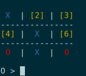

### morpion-rs

Yet another [Tic-Tac-Toe](https://en.wikipedia.org/wiki/Tic-tac-toe) CLI game (in Rust) against the computer.  
The player to start is randomly selected.  
The computer player is using [min max algorithm](https://en.wikipedia.org/wiki/Minimax) so it shouldn't really be able to loose.  

